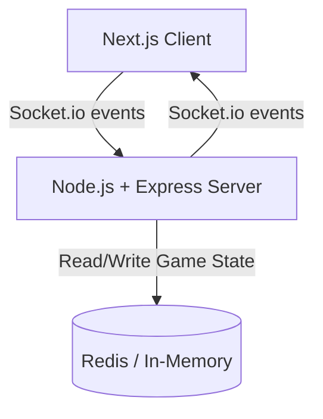

# Architecture Diagram

```mermaid
graph TD;
    Client[Next.js Client] -->|Socket.io events| Backend[Node.js + Express Server];
    Backend -->|Socket.io events| Client;
    Backend -->|Read/Write Game State| Database[(Redis / In-Memory)];
```
